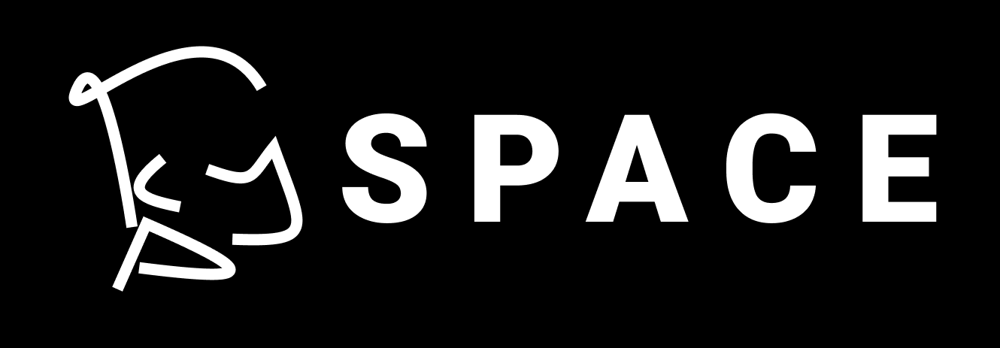

<link rel="stylesheet" href="./assets/styles.css" type="text/css">

# FULL STACK DEVELOPER

<a href="https://www.jjcp.space" target="_blank">
    <picture>
        <!-- AVIF format for modern browsers that support it -->
        <source srcset="assets/logo.avif" type="image/avif">
        <!-- WebP format for modern browsers -->
        <source srcset="assets/logo.webp" type="image/webp">
        <!-- JPEG format for older browsers -->
        
    </picture>
</a>

# Hi, I'm Javier! 👋

I am Javier Cornejo, a fullstack developer who brings innovation and efficiency to the heart of projects. I've learned about Software Development and best practices through courses in my university and I've worked in various projects that allowed me to improve my skills with practice.

## 🛠 Expertise

<ol>
    <li style="--accent-color:#354c7c">
        
BACKEND

        
Most experiencie in backend

    </li>
    <li style="--accent-color:#505a74">
        
FRONTEND

        
Freelance and first jobs as frontend

    </li>
    <li style="--accent-color:#b0b8ce">
        
DEVOPS

        
Experience using AWS cloud

    </li>
    <li style="--accent-color:#BDBEBE">
        
SECURITY

        
TDD, OWASP, LINUX

    </li>
</ol>

## ⚡️ Skills

**Code:**  Javascript, Typescript, Java, Python, Golang, CSS, SASS, HTML, GraphQL, gRPC, Json.

**Stack:** NodeJS, ReactJS, Express, Angular, NestJS, NextJS, Django, LernaJS, Figma, Spring, Nginx, Docker.

**Repository:** Git, GitLab, GitHub, Jira, AzureDevOps.

**DB:** Mongo, PostgreSQL, redis, DocumentDB.

**Cloud:** AWS (ECR,ECS,Lambda, SQS, SNS, Step Function...) certified, Digital Ocean, Firebase.

**Concepts:** Scrum, Microservices, Design Patterns, Monorepo.

## 🔗 How to reach me

